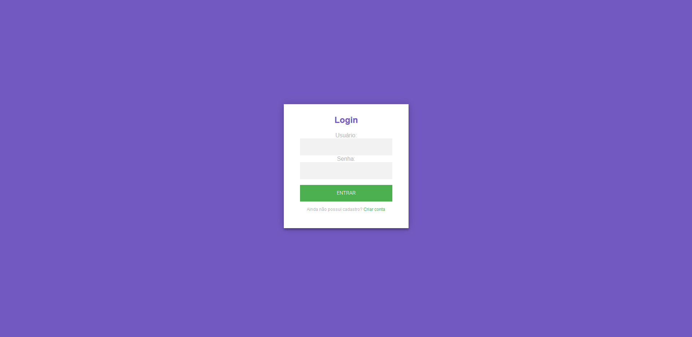
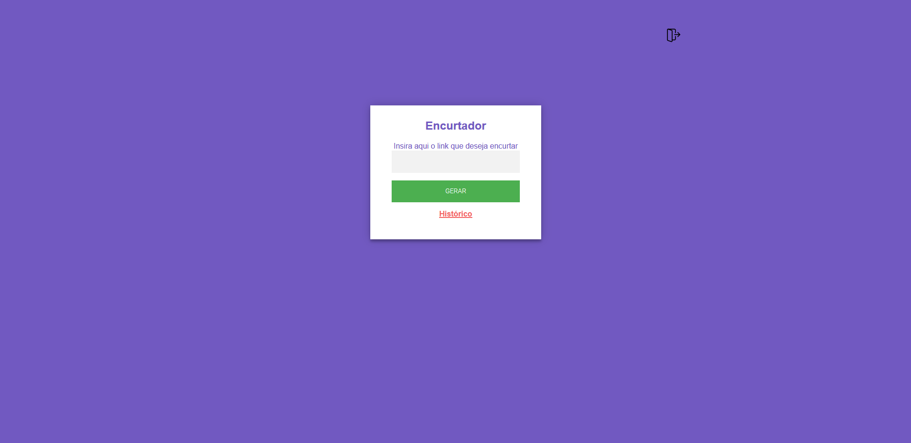
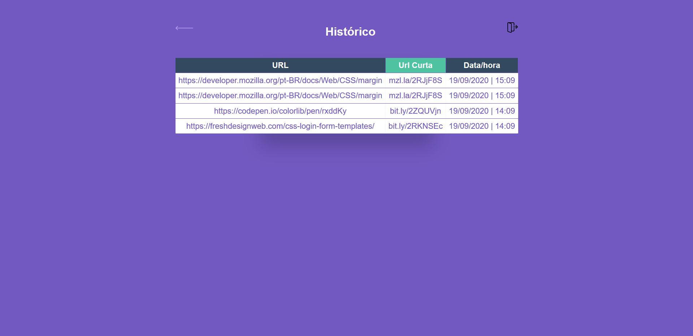

<h1 align="center">Encurtador de Link</h1> 

## Tecnologias utilizadas

O projeto foi desenvolvido utilizando as tecnologias:

- ReactJS
- HTML5 e CSS3
- NodeJS
- MongoDB

## Design

<table>
  <tr>
    <td colspan="2">Desktop</td>
 </tr>
  <tr>
    <td></td><td></td>
    <td></td><td></td>
    <td></td><td></td>
  </tr>
</table>

## Instalando e iniciando o MongoDB

- Clique [aqui](https://www.mongodb.com/)para ir ao site do `MongoDB`
- Crie o local: `C:\data\db`
- Inicie o `mongod` na pasta raiz:\Program Files\MongoDB\Server\4.4\bin
- Tudo Pronto!

## Executar esse projeto no seu computador

- Clonar Repositório: `git clone https://github.com/juliopurschel/encurtador.git`

Ir para a pasta 'web' para rodar o front-end, ou ir para pasta 'back' para rodar o back-end:

- Instalar dependências: `yarn install`
- Rodar Aplicação Front: `yarn start`
- Rodar Aplicação Back: `yarn dev`

Todos os arquivos incluídos aqui, incluindo este _README_, estão sob [Licença MIT](./LICENSE). 
Criado por [Julio Purschel](https://github.com/juliopurschel)
